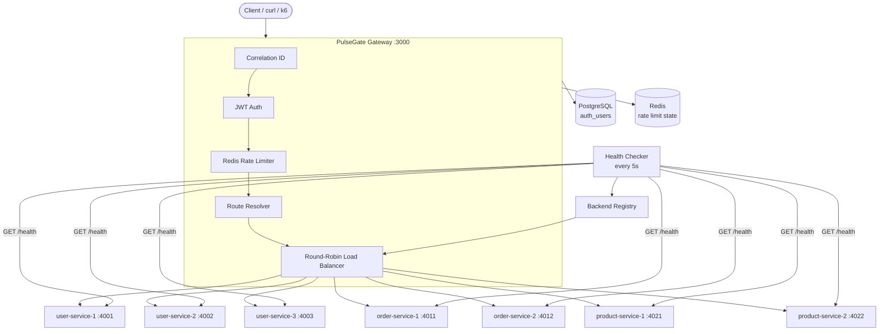
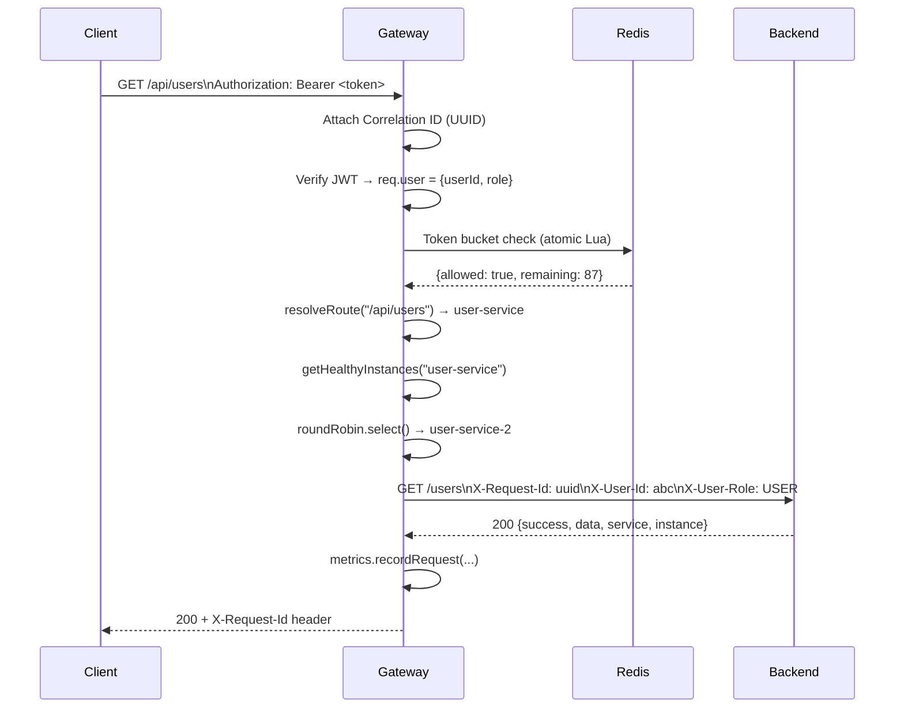

# PulseGate

**Production-Style API Gateway & Traffic Manager**

[](https://github.com/Om-Beast/PulseGate/actions)
[](https://nodejs.org)
[](https://www.typescriptlang.org)
[](LICENSE)

---

## Overview

PulseGate is a self-contained, production-minded API gateway that demonstrates the core engineering concepts behind systems like AWS API Gateway, Kong, and NGINX — built from scratch using Node.js, TypeScript, Redis, and PostgreSQL.

It is designed as a serious final-year software engineering project that you can explain in depth in any technical interview.

---

## Problem

Modern distributed applications need a single entry point that:
- Routes requests to the correct backend service
- Authenticates callers before they hit your services
- Prevents abuse via rate limiting
- Distributes load across healthy instances
- Automatically removes failed backends from rotation
- Provides observability into traffic, latency, and errors

Building this yourself teaches you more than using a black-box managed service.

---

## Solution

PulseGate implements a complete API gateway with:

- **Reverse Proxy** — forwards requests to backends using Node's built-in `http` module
- **Round-Robin Load Balancer** — distributes traffic evenly across instances per service
- **Health Checker** — polls every backend every 5 seconds; marks unhealthy after 3 failures, recovers after 2 successes
- **JWT Authentication** — verifies tokens, attaches identity to forwarded headers
- **Redis Token Bucket** — distributed rate limiting with per-role policies (30/100/500 req/min)
- **Correlation IDs** — every request gets a UUID that flows through logs, errors, and backends
- **Metrics** — real-time p50/p95/p99 latency, request counts by route and backend, error rates
- **Operational Dashboard** — React + Tailwind dark UI polling real gateway data every 5 seconds

---

## Architecture



---

## Request Lifecycle



---

## Key Features

| Feature | Implementation |
|---|---|
| Reverse Proxy | Node.js `http.request` — no external proxy library |
| Load Balancing | Round-robin with per-service counters |
| Health Checking | Background poller, 3-failure / 2-success hysteresis |
| Authentication | JWT (jsonwebtoken), PostgreSQL users, bcrypt passwords |
| Rate Limiting | Redis Lua script token bucket, per-role policies |
| Correlation IDs | UUID v4, preserved or generated per request |
| Retry Logic | One retry for GET/HEAD/OPTIONS on different instance |
| Metrics | p50/p95/p99 latency, per-route/backend counts |
| Structured Logging | JSON logs with sensitive field redaction |
| Dashboard | React + Tailwind + Recharts, polling every 5s |
| Testing | Jest + Supertest: 78 tests across 9 test suites |
| CI | GitHub Actions: build + test + Docker validate |

---

## Why PulseGate

- **No framework magic** — the proxy, load balancer, and health checker are hand-written so you understand every line
- **Production patterns** — correlation IDs, distributed rate limiting, graceful shutdown, health hysteresis
- **Interview-ready** — every design decision (why token bucket? why not retry POST?) is documented
- **Clean monorepo** — npm workspaces, consistent TypeScript strict mode, shared tooling

---

## Technology Stack

| Layer | Technology |
|---|---|
| Runtime | Node.js 20 |
| Language | TypeScript 5 (strict) |
| Web Framework | Express 4 |
| Authentication | jsonwebtoken + bcryptjs |
| Database | PostgreSQL 16 (auth users) |
| Distributed State | Redis 7 (rate limiting) |
| Frontend | React 18 + Vite + Tailwind CSS + Recharts |
| Testing | Jest + Supertest + ts-jest |
| Load Testing | k6 |
| Infrastructure | Docker + Docker Compose |
| CI | GitHub Actions |

---

## Repository Structure

```
PulseGate/
├── .github/workflows/ci.yml     # GitHub Actions CI
├── gateway/                     # API Gateway (core)
│   ├── src/
│   │   ├── auth/                # JWT, bcrypt, PostgreSQL auth
│   │   ├── config/              # Routes, services, settings
│   │   ├── errors/              # GatewayError + factory functions
│   │   ├── health/              # Background health checker
│   │   ├── loadBalancer/        # ILoadBalancer + RoundRobin
│   │   ├── logging/             # Structured JSON logger
│   │   ├── metrics/             # MetricsCollector (p50/p95/p99)
│   │   ├── middleware/          # correlationId, auth, rateLimit, errorHandler
│   │   ├── rateLimiter/         # Redis token bucket (Lua script)
│   │   ├── registry/            # BackendRegistry
│   │   ├── routing/             # Route resolver
│   │   ├── types/               # Shared TypeScript interfaces
│   │   ├── app.ts               # Express app + proxy handler
│   │   └── server.ts            # Startup + graceful shutdown
│   └── tests/
│       ├── unit/                # roundRobin, routeResolver, metrics, errors
│       └── integration/         # health, auth, API routes
├── services/
│   ├── user-service/            # 3 instances (ports 4001-4003)
│   ├── order-service/           # 2 instances (ports 4011-4012)
│   └── product-service/         # 2 instances (ports 4021-4022)
├── dashboard/                   # React operational dashboard
│   └── src/
│       ├── components/          # KpiCard, InstanceTable, RequestsTable, charts
│       ├── pages/               # Overview, Services, Traffic, Requests, System
│       ├── hooks/               # useDashboardData (5s polling)
│       └── lib/api.ts           # Fetch wrappers for /admin/* endpoints
├── load-tests/                  # k6 scripts
│   ├── gateway.js               # Normal load test
│   ├── rate-limit.js            # Rate limiting stress test
│   └── failure.js               # Backend failure scenario
├── docs/                        # Architecture, API, auth, rate-limiting docs
├── infra/docker/docker-compose.yml
├── .env.example
└── README.md
```

---

## Local Development

### Prerequisites

- Node.js 20+
- npm 10+
- Docker Desktop (for full stack)

### Quick Start

```bash
# Clone
git clone https://github.com/Om-Beast/PulseGate
cd PulseGate

# Install all workspace dependencies
npm install

# Copy environment file
cp .env.example .env

# Start the full stack with Docker
docker compose -f infra/docker/docker-compose.yml up --build -d

# Check services are healthy
docker compose -f infra/docker/docker-compose.yml ps
```

### Without Docker (development only)

```bash
# Start Redis and PostgreSQL separately
# Then build and run the gateway:
npm run build:gateway
cd gateway && npm start

# Or in dev mode (with ts-node):
cd gateway && npm run dev
```

---

## Docker Setup

The complete stack runs with one command:

```bash
docker compose -f infra/docker/docker-compose.yml up --build -d
```

Services started:

| Service | Port | Notes |
|---|---|---|
| Gateway | 3000 | API entry point |
| Dashboard | 8080 | Operations UI |
| Redis | 6379 | Rate limit state |
| PostgreSQL | 5432 | Auth users |
| user-service-1 | 4001 | Exposed for debug |
| order-service-1 | 4011 | Exposed for debug |
| product-service-1 | 4021 | Exposed for debug |

Instances 2 and 3 are internal only (no host port exposure).

---

## Authentication

```bash
# Register
curl -X POST http://localhost:3000/auth/register \
  -H 'Content-Type: application/json' \
  -d '{"name":"Alice","email":"alice@example.com","password":"securepass123"}'

# Login
curl -X POST http://localhost:3000/auth/login \
  -H 'Content-Type: application/json' \
  -d '{"email":"alice@example.com","password":"securepass123"}'

# Use token (copy from login response)
TOKEN="<paste token here>"

curl http://localhost:3000/api/users \
  -H "Authorization: Bearer $TOKEN"
```

---

## Distributed Rate Limiting

Token bucket algorithm with per-role policies:

| Role | Limit | Window |
|---|---|---|
| Anonymous (IP) | 30 req | 60s |
| USER | 100 req | 60s |
| PREMIUM | 500 req | 60s |
| ADMIN | 500 req | 60s |

Rate limit state is stored in Redis — shared across gateway restarts.

On exceeding limit:
```json
{
  "success": false,
  "error": { "code": "RATE_LIMIT_EXCEEDED", "message": "Too many requests" },
  "requestId": "uuid"
}
```
With `Retry-After: <seconds>` header.

---

## Load Balancing

Round-robin across healthy instances per service:

```
Request 1 → user-service-1
Request 2 → user-service-2
Request 3 → user-service-3
Request 4 → user-service-1  ← wraps
```

**To observe this:**
```bash
for i in $(seq 1 6); do
  curl -s http://localhost:3000/api/users \
    -H "Authorization: Bearer $TOKEN" | python -m json.tool | grep instance
done
```

---

## Health Checking

The health checker runs every 5 seconds and probes `GET /health` on all 7 instances.

State transitions:
- **HEALTHY → UNHEALTHY**: 3 consecutive failures
- **UNHEALTHY → HEALTHY**: 2 consecutive successes

**Demo backend failure:**
```bash
# Stop one instance
docker compose -f infra/docker/docker-compose.yml stop user-service-2

# Watch traffic skip it (after ~15 seconds)
for i in $(seq 1 10); do
  curl -s http://localhost:3000/api/users -H "Authorization: Bearer $TOKEN" | grep instance
  sleep 1
done

# Restart and watch recovery
docker compose -f infra/docker/docker-compose.yml start user-service-2
```

---

## Failure Handling

| Scenario | Gateway Response |
|---|---|
| Unknown route | 404 ROUTE_NOT_FOUND |
| Missing JWT | 401 UNAUTHORIZED |
| Invalid/expired JWT | 401 INVALID_TOKEN |
| Rate limit exceeded | 429 RATE_LIMIT_EXCEEDED + Retry-After |
| User role on admin API | 403 FORBIDDEN |
| Backend unreachable | 503 SERVICE_UNAVAILABLE (retries once for GET) |
| All backends down | 503 SERVICE_UNAVAILABLE |
| Backend timeout (>10s) | 504 REQUEST_TIMEOUT |

---

## Observability

### Structured Logs
Every request logged as JSON:
```json
{
  "timestamp": "2026-08-29T12:00:00.000Z",
  "level": "info",
  "message": "request completed",
  "requestId": "a3f8c91d-...",
  "method": "GET",
  "path": "/api/users",
  "statusCode": 200,
  "latencyMs": 32,
  "service": "user-service",
  "instance": "user-service-2"
}
```

### Admin APIs
```bash
curl http://localhost:3000/admin/metrics -H "Authorization: Bearer $ADMIN_TOKEN"
curl http://localhost:3000/admin/services -H "Authorization: Bearer $ADMIN_TOKEN"
curl http://localhost:3000/admin/requests -H "Authorization: Bearer $ADMIN_TOKEN"
curl http://localhost:3000/admin/routes -H "Authorization: Bearer $ADMIN_TOKEN"
```

---

## Dashboard

Open **http://localhost:8080** after starting the Docker stack.

Pages:
- **Overview** — KPI cards (requests, P95 latency, error rate, rate limited), instance health table, traffic + latency charts, recent requests
- **Services** — per-service health cards with instance details
- **Traffic** — full-width charts for request volume and latency percentiles
- **Rate Limits** — policy table + rate-limited request counts
- **Requests** — filterable log of recent 500 requests
- **System** — route configuration and gateway info

The dashboard polls `/admin/*` endpoints every 5 seconds using real gateway data.

---

## Testing

```bash
# All tests
npm test

# Gateway only
npm run test:gateway

# Services only
npm run test:services

# Individual service
npm run test --workspace=@pulsegate/user-service
```

**Test coverage:**

| Suite | Tests | Covers |
|---|---|---|
| Gateway unit | 44 | roundRobin, routeResolver, correlationId, gatewayError, metrics |
| Gateway integration | 16 | /health, auth register/login, protected routes, admin auth |
| user-service | 6 | CRUD, validation, 404 |
| order-service | 6 | CRUD, validation, 404 |
| product-service | 6 | CRUD, validation, 404 |
| **Total** | **78** | |

---

## Load Testing

Install k6: https://k6.io/docs/get-started/installation/

```bash
# Normal gateway load
k6 run load-tests/gateway.js

# Rate limit stress test
k6 run load-tests/rate-limit.js

# Failure scenario (follow instructions in script)
k6 run load-tests/failure.js
```

---

## Failure Demonstrations

See [docs/failure-scenarios.md](docs/failure-scenarios.md) for all 9 demos with exact commands.

Quick reference:

```bash
# Demo 1: Health check
curl http://localhost:3000/health

# Demo 2: Round-robin (run 6 times, watch instance rotate)
curl http://localhost:3000/api/users -H "Authorization: Bearer $TOKEN"

# Demo 4: Invalid JWT
curl http://localhost:3000/api/users -H "Authorization: Bearer invalid.jwt.here"

# Demo 8: Unknown route
curl http://localhost:3000/api/doesnotexist -H "Authorization: Bearer $TOKEN"
```

---

## Design Decisions

**Why token bucket over fixed window?**
Fixed window allows burst abuse at window boundaries. Token bucket smooths requests over time and is a better real-world model.

**Why Redis for rate limiting?**
In-memory state doesn't survive restarts and can't be shared across gateway replicas. Redis provides atomic operations via Lua scripts.

**Why not retry POST requests?**
POST is not idempotent — retrying may create duplicate records. We only retry `GET`, `HEAD`, and `OPTIONS`.

**Why Node's built-in `http` module over `http-proxy-middleware`?**
Manual control over headers, timeout, and retry logic without proxy library abstractions. Easier to reason about and explain.

**Why not Kubernetes, Kafka, or GraphQL?**
This project demonstrates gateway concepts clearly. Unnecessary infrastructure complexity would obscure the learning and make it harder to explain.

---

## Trade-offs

| Decision | Advantage | Trade-off |
|---|---|---|
| In-memory metrics | Simple, no external dep | Lost on restart |
| Single gateway instance | Easy to reason about | Not HA by itself |
| In-memory service data | No DB per service | Resets on restart |
| Lua rate limit script | Atomic, correct | Redis required |
| Round robin only | Predictable, fast | Not capacity-aware |

---

## Future Improvements

- Persistent metrics store (TimescaleDB or InfluxDB)
- Multiple gateway instances sharing state via Redis
- Circuit breaker pattern
- JWT refresh tokens
- Dashboard authentication
- WebSocket support for real-time dashboard updates
- Configurable routing rules via admin API (not just static config)

---

## Interview Talking Points

1. **Why build an API Gateway?** — Centralizes auth, rate limiting, routing, and observability rather than duplicating in every service.

2. **How does the proxy work?** — `http.request` forwards method/headers/body to selected backend, strips auth headers, injects identity headers.

3. **Why token bucket?** — Allows short bursts while enforcing a sustained rate. Fixed window is gameable at boundaries.

4. **Why Redis for rate limiting?** — Atomic Lua script; state shared across restarts and future gateway replicas.

5. **How does health checking work?** — Poll every 5s, mark unhealthy after 3 consecutive failures, recover after 2 successes (hysteresis prevents flapping).

6. **Why not retry POST?** — Not idempotent; retrying could create duplicate resources.

7. **How is load balancing fair?** — Per-service counters mean users and orders don't interfere with each other's rotation.

8. **What happens when all backends are down?** — `getHealthyInstances()` returns empty array → 503 SERVICE_UNAVAILABLE immediately, no hang.

9. **How are correlation IDs useful?** — Every log, error, and metric includes the same UUID, making it trivial to trace a request end-to-end across services.

10. **What's the bottleneck?** — Single-threaded Node.js event loop. Solution: run multiple gateway instances behind a load balancer, sharing Redis state.
