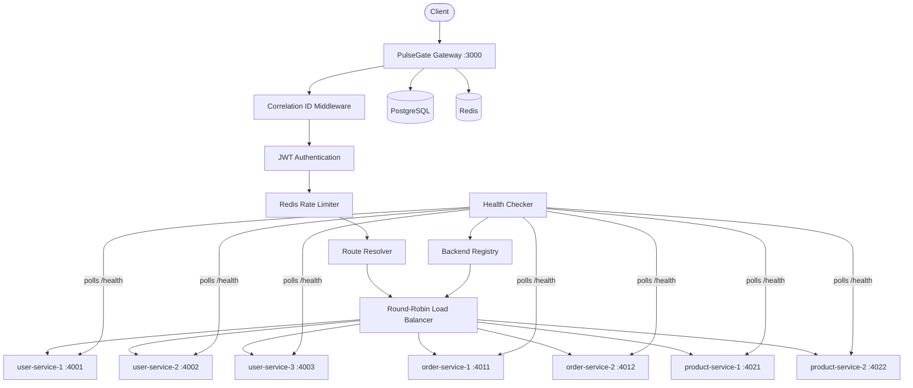
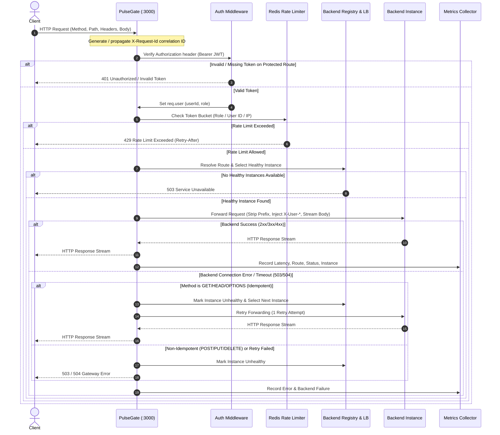

# PulseGate Architecture

## System Overview

PulseGate is a high-performance, resilient, production-style API Gateway and Traffic Manager built with Node.js, TypeScript, Express, Redis, and PostgreSQL. It acts as the single entry point for all client applications, providing unified routing, identity verification, distributed rate limiting, client-side/gateway load balancing, proactive backend health checking, and telemetry collection.

```
+-----------------------------------------------------------------------------------+
|                               PulseGate API Gateway                               |
|                                                                                   |
|  [Correlation ID] -> [JWT Auth] -> [Redis Rate Limiter] -> [Route Resolver & LB]  |
|         |                                                           |             |
|         v                                                           v             |
|  [Structured Logger]                                       [Backend Microservices]|
+-----------------------------------------------------------------------------------+
```

### Core Responsibilities

1. **Edge Request Routing:** Maps public URL prefixes (such as `/api/users`, `/api/orders`, `/api/products`) to backend microservice clusters and strips internal route prefixes.
2. **Authentication & Authorization:** Issues and verifies JSON Web Tokens (JWTs), enforces Role-Based Access Control (`USER`, `PREMIUM`, `ADMIN`), and strips untrusted client headers while injecting trusted identity assertions (`X-User-Id`, `X-User-Role`).
3. **Distributed Rate Limiting:** Implements a token bucket algorithm evaluated atomically via Redis Lua scripts, enforcing tiered rate limits per identity (or client IP for anonymous traffic).
4. **Resilient Load Balancing:** Uses per-service round-robin algorithms with automatic retry capabilities for idempotent HTTP methods (`GET`, `HEAD`, `OPTIONS`) upon backend communication errors.
5. **Continuous Health Monitoring:** Continuously probes backend instances using a background worker with failure and recovery hysteresis to prevent routing flapping.
6. **Telemetry & Admin Observability:** Ingests latency metrics, request counts, error rates, and backend health states into memory for real-time querying via admin endpoints and operational dashboards.

---

## System Architecture Diagram

The following diagram illustrates the deployment topology of the PulseGate Gateway, its data stores, and backend microservice instances:



---

## Request Flow Diagram

The lifecycle of an incoming request from arrival at the gateway to backend forwarding and client response delivery is detailed below:



---

## Component Responsibilities

### 1. Gateway Server (`src/server.ts`, `src/app.ts`)
- **Port:** Configurable via `PORT` or `GATEWAY_PORT` (default: `3000`).
- Initializes Express application, applies top-level security middleware (`helmet`, `cors`), and mounts route handlers.
- Manages graceful shutdown on `SIGTERM` and `SIGINT`, disconnecting Redis and PostgreSQL connection pools cleanly.

### 2. Middleware Pipeline
- **Correlation ID (`src/middleware/correlationId.ts`):** Extracts incoming `X-Request-Id` or generates a standard UUID v4. Injects `X-Request-Id` into the outgoing HTTP response and downstream proxy request headers.
- **Request Logger (`src/middleware/requestLogger.ts`):** Logs inbound requests with timestamp, method, path, IP, and correlation ID.
- **Authentication (`src/middleware/auth.ts`):** Parses `Authorization: Bearer <token>` headers, validates JWT signatures using the shared secret, and attaches decoded payload `{ userId, role }` to `req.user`.
- **Rate Limiting (`src/middleware/rateLimit.ts`):** Invokes the distributed token-bucket evaluator before routing requests. Appends `X-RateLimit-Remaining` and `Retry-After` headers.
- **Error Handler (`src/middleware/errorHandler.ts`):** Catches synchronous and asynchronous exceptions, converting them to standardized Gateway JSON error responses with consistent HTTP status codes.

### 3. Route Resolver (`src/config/routes.ts`)
Maps request URL paths to target logical service identifiers and defines prefix stripping rules:

| Path Prefix | Target Service | Path Transformation |
|-------------|----------------|---------------------|
| `/api/users` | `user-service` | Strips `/api` -> `/users` |
| `/api/orders` | `order-service` | Strips `/api` -> `/orders` |
| `/api/products` | `product-service` | Strips `/api` -> `/products` |

### 4. Load Balancer (`src/loadBalancer/roundRobin.ts`)
- Implements client-side Round Robin load balancing.
- Maintains per-service isolated monotonic counters in memory (`Map<string, number>`).
- Filters the instance list received from the backend registry to only include instances marked `healthy: true`.
- Evaluates `selected = healthyInstances[counter % healthyInstances.length]`.

### 5. Backend Registry (`src/registry/backendRegistry.ts`)
- Maintains the in-memory registry of all configured service instances, their network hostnames, ports, and operational health states.
- Exposes querying methods (`getAllInstances()`, `getHealthyInstances(service)`).
- Exposes status mutation methods (`markHealthy(instanceId)`, `markUnhealthy(instanceId)`).

### 6. Health Checker (`src/health/healthChecker.ts`)
- Background polling daemon running on a fixed 5000ms interval (`HEALTH_CHECK_INTERVAL`).
- Dispatches HTTP `GET http://<host>:<port>/health` with a strict 3000ms timeout.
- Implements state transition hysteresis:
  - **Healthy to Unhealthy:** Requires 3 consecutive health check failures.
  - **Unhealthy to Healthy:** Requires 2 consecutive successful health checks.

### 7. Redis Rate Limiter (`src/rateLimiter/redisRateLimiter.ts`)
- Connects to Redis (default port `6379`).
- Executes an atomic Lua script that manages token counts and last refill timestamps in a Redis Hash.
- Implements a fail-open design: if Redis is unreachable or returns an error, requests are allowed through with maximum policy capacity to prevent total gateway outage.

### 8. Authentication Service & Database (`src/auth/`)
- Backed by PostgreSQL 16 (default port `5432`).
- Stores user credentials in table `auth_users` (`id`, `name`, `email`, `password_hash`, `role`, `created_at`).
- Uses `bcryptjs` with 12 salt rounds for secure password hashing.
- Issues 24-hour signed JWTs containing user ID and authorization role.

### 9. Metrics Collector (`src/metrics/metricsCollector.ts`)
- Records real-time gateway performance metrics in memory:
  - Total request count, 2xx/3xx successes, 4xx client errors, 5xx server errors, 429 rate limit events.
  - Latency measurements (p50, p95, p99 percentiles calculated over a rolling window of 10,000 samples).
  - Per-route request counters and per-backend traffic distribution.
  - Circular buffer of the last 500 requests (`RecentRequest`).

---

## Network & Deployment Topology

| Component | Container Name | Host Port | Container Port | Protocol / Purpose |
|-----------|----------------|-----------|----------------|--------------------|
| Gateway | `gateway` | `3000` | `3000` | HTTP / API Entry Point |
| PostgreSQL | `postgres` | `5432` | `5432` | TCP / User Credentials Store |
| Redis | `redis` | `6379` | `6379` | TCP / Rate Limiting Distributed State |
| User Service Instance 1 | `user-service-1` | `4001` | `4001` | HTTP / User CRUD & Health |
| User Service Instance 2 | `user-service-2` | *Internal* | `4002` | HTTP / User CRUD & Health |
| User Service Instance 3 | `user-service-3` | *Internal* | `4003` | HTTP / User CRUD & Health |
| Order Service Instance 1 | `order-service-1` | `4011` | `4011` | HTTP / Order CRUD & Health |
| Order Service Instance 2 | `order-service-2` | *Internal* | `4012` | HTTP / Order CRUD & Health |
| Product Service Instance 1 | `product-service-1` | `4021` | `4021` | HTTP / Product CRUD & Health |
| Product Service Instance 2 | `product-service-2` | *Internal* | `4022` | HTTP / Product CRUD & Health |
| Dashboard UI | `dashboard` | `8080` | `80` | HTTP / React & Nginx Operational UI |

All services communicate over the isolated Docker bridge network `pulsegate`. Instances not exposed to host ports communicate directly via Docker internal DNS names.

---

## Data Flow & Security Boundary

```
[Untrusted Client Request]
       |
       |  Headers: { Authorization: "Bearer eyJ...", Host: "api.example.com", X-User-Id: "fake-admin" }
       v
+-----------------------------------------------------------------------------------+
|                             PulseGate Gateway (Trust Boundary)                    |
|                                                                                   |
|  1. Discard untrusted incoming 'Host', 'Authorization', 'X-User-Id', 'X-User-Role'|
|  2. Verify JWT signature using internal JWT_SECRET                                |
|  3. Inject trusted identity headers from validated token:                         |
|     - X-Request-Id: <generated-uuid>                                              |
|     - X-User-Id: <token.userId>                                                   |
|     - X-User-Role: <token.role>                                                   |
+-----------------------------------------------------------------------------------+
       |
       |  Forwarded over private network
       v
[Downstream Microservice (:4001 - :4022)]
```

- **Zero-Trust Client Identity:** Clients cannot spoof backend user IDs or roles. Even if a client sends `X-User-Id: admin`, the gateway completely overwrites or removes this header during proxying and injects the cryptographically validated token claims.
- **Header Sanitization:** Sensitive client authentication headers like `Authorization` are stripped before forwarding to internal backends, preventing token leakage to downstream services.
