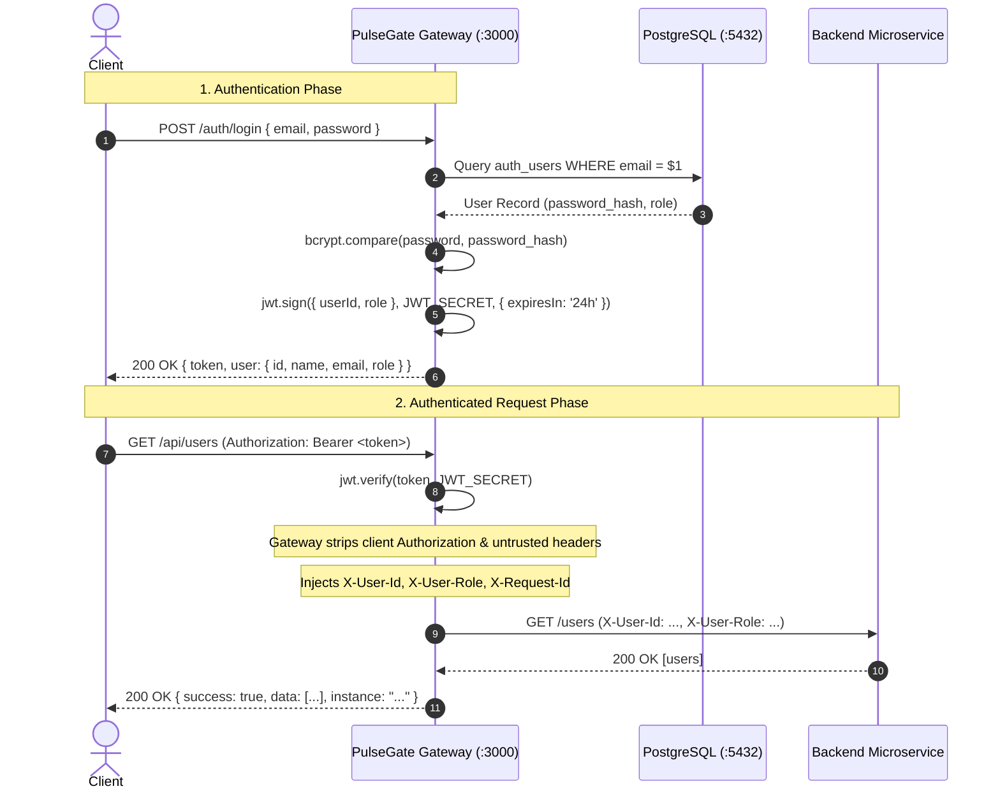

# Authentication & Authorization in PulseGate

PulseGate implements a centralized, token-based authentication and role-based access control (RBAC) architecture using JSON Web Tokens (JWT), PostgreSQL, and `bcryptjs`.

---

## 1. Authentication Architecture & Flow

Authentication is terminated entirely at the gateway boundary. Downstream microservices do not perform JWT parsing or database credential verification; instead, the gateway acts as the trusted identity verification layer.



---

## 2. Password Security & Registration

### Password Hashing
User passwords are never stored in plaintext. PulseGate uses `bcryptjs` with an adaptive cost factor:
- **Salt Rounds:** `12`
- **Hash Format:** Modular Crypt Format `$2a$12$...`
- **Resistance:** Built-in salt generation prevents rainbow table attacks and protects against brute-force attacks.

```typescript
// src/auth/password.ts
export async function hashPassword(password: string): Promise<string> {
  return bcrypt.hash(password, 12);
}

export async function comparePassword(password: string, hash: string): Promise<boolean> {
  return bcrypt.compare(password, hash);
}
```

### PostgreSQL Database Schema
User credentials and roles are persisted in the `auth_users` table:

```sql
CREATE TABLE IF NOT EXISTS auth_users (
  id UUID PRIMARY KEY DEFAULT gen_random_uuid(),
  name VARCHAR(255) NOT NULL,
  email VARCHAR(255) UNIQUE NOT NULL,
  password_hash VARCHAR(255) NOT NULL,
  role VARCHAR(50) NOT NULL DEFAULT 'USER',
  created_at TIMESTAMPTZ DEFAULT NOW()
);
```

---

## 3. JWT Token Structure & Lifecycle

### Token Structure
PulseGate issues standard compact JSON Web Tokens signed using HMAC-SHA256 (`HS256`).

#### Token Header
```json
{
  "alg": "HS256",
  "typ": "JWT"
}
```

#### Token Payload Claims
```json
{
  "userId": "3fa85f64-5717-4562-b3fc-2c963f66afa6",
  "role": "USER",
  "iat": 1725150000,
  "exp": 1725236400
}
```

- `userId` (string): The UUID identifier of the authenticated user in PostgreSQL.
- `role` (string): The authorization role assigned to the user (`USER`, `PREMIUM`, or `ADMIN`).
- `iat` (number): Epoch timestamp when the token was issued.
- `exp` (number): Epoch timestamp when the token expires (configured to 24 hours).

### Token Signing & Secret Key
Tokens are signed and verified using `JWT_SECRET`:
```typescript
// src/auth/jwt.ts
export function signToken(payload: { userId: string; role: string }): string {
  return jwt.sign(payload, config.jwtSecret, { expiresIn: '24h' });
}

export function verifyToken(token: string): JwtPayload {
  return jwt.verify(token, config.jwtSecret) as JwtPayload;
}
```

---

## 4. Role-Based Access Control (RBAC)

PulseGate defines three distinct user roles:

| Role | Description | Allowed Endpoints | Rate Limit |
|------|-------------|-------------------|------------|
| `USER` | Standard registered user | `/api/users`, `/api/orders`, `/api/products` | 100 req/min |
| `PREMIUM` | High-throughput tier user | `/api/users`, `/api/orders`, `/api/products` | 500 req/min |
| `ADMIN` | Gateway administrator | `/api/*` and `/admin/*` (`/admin/services`, `/admin/routes`, `/admin/metrics`, `/admin/requests`) | 500 req/min |
| *Anonymous* | Unauthenticated user | `/health`, `/auth/register`, `/auth/login` | 30 req/min |

### Admin Route Protection Middleware
Admin routes enforce role checks immediately following JWT verification:

```typescript
// src/app.ts
const requireAdmin = [
  requireAuth,
  (req: Request, res: Response, next: NextFunction) => {
    if (req.user?.role !== 'ADMIN') {
      return next(forbidden()); // Returns 403 FORBIDDEN
    }
    next();
  }
];

app.get('/admin/services', ...requireAdmin, (req, res) => { ... });
app.get('/admin/routes', ...requireAdmin, (req, res) => { ... });
app.get('/admin/metrics', ...requireAdmin, (req, res) => { ... });
app.get('/admin/requests', ...requireAdmin, (req, res) => { ... });
```

---

## 5. Gateway Auth Middleware Behavior

When an incoming request hits a protected route (`/api/*` or `/admin/*`), the `requireAuth` middleware executes:

```typescript
// src/middleware/auth.ts
export function requireAuth(req: Request, res: Response, next: NextFunction) {
  const authHeader = req.headers.authorization;
  if (!authHeader || !authHeader.startsWith('Bearer ')) {
    return next(unauthorized()); // Returns 401 UNAUTHORIZED
  }

  const token = authHeader.substring(7);
  try {
    const payload = verifyToken(token);
    req.user = payload;
    next();
  } catch (err) {
    return next(invalidToken()); // Returns 401 INVALID_TOKEN
  }
}
```

### Failure Behaviors:
1. **Missing or Malformed Header:** If `Authorization` is missing or does not start with `Bearer `, the gateway returns `401 UNAUTHORIZED`.
2. **Invalid Signature or Expired Token:** If `jwt.verify()` throws (expired, invalid secret, tampered payload), the gateway returns `401 INVALID_TOKEN`.

---

## 6. Internal Identity Forwarding & Zero-Trust Boundary

A primary security rule of the PulseGate architecture is: **Never trust client-supplied identity headers.**

### Untrusted Client Attack Vector
If clients could send arbitrary `X-User-Id: 1` or `X-User-Role: ADMIN` headers and the gateway forwarded them uninspected, malicious actors could impersonate arbitrary users or bypass authorization checks in backend microservices.

### Gateway Sanitization & Injection
To prevent identity spoofing and header injection:
1. The gateway extracts and verifies the caller's identity exclusively from the cryptographically signed JWT.
2. The proxy layer deletes the client's original `authorization` and `host` headers.
3. The gateway injects verified, authoritative headers into the backend request:
   - `X-Request-Id`: Request correlation UUID.
   - `X-User-Id`: Extracted `userId` from the verified token payload.
   - `X-User-Role`: Extracted `role` from the verified token payload.

```typescript
// src/app.ts proxyRequest()
delete options.headers['host'];
delete options.headers['authorization'];

if (req.requestId) options.headers['X-Request-Id'] = req.requestId;
if (req.user) {
  options.headers['X-User-Id'] = req.user.userId;
  options.headers['X-User-Role'] = req.user.role;
}
```

Downstream microservices can safely rely on `req.headers['x-user-id']` and `req.headers['x-user-role']` because those headers can only be injected by the gateway on the private Docker network.

---

## 7. Command-Line (cURL) Examples

### 1. Register a New Account
```bash
curl -X POST http://localhost:3000/auth/register \
  -H 'Content-Type: application/json' \
  -d '{
    "name": "Alice",
    "email": "alice@example.com",
    "password": "securepass123"
  }'
```

**Expected Response (`201 Created`):**
```json
{
  "success": true,
  "data": {
    "token": "eyJhbGciOiJIUzI1NiIsInR5cCI6IkpXVCJ9...",
    "user": {
      "id": "e4b2d184-98bb-4cbb-9276-21ec069f5ad3",
      "name": "Alice",
      "email": "alice@example.com",
      "role": "USER"
    }
  }
}
```

---

### 2. Login to Obtain a JWT
```bash
curl -X POST http://localhost:3000/auth/login \
  -H 'Content-Type: application/json' \
  -d '{
    "email": "alice@example.com",
    "password": "securepass123"
  }'
```

**Expected Response (`200 OK`):**
```json
{
  "success": true,
  "data": {
    "token": "eyJhbGciOiJIUzI1NiIsInR5cCI6IkpXVCJ9...",
    "user": {
      "id": "e4b2d184-98bb-4cbb-9276-21ec069f5ad3",
      "name": "Alice",
      "email": "alice@example.com",
      "role": "USER"
    }
  }
}
```

---

### 3. Use the Token to Access Protected Routes
```bash
# Save token to variable
TOKEN="<paste-jwt-token-here>"

# Request users list
curl http://localhost:3000/api/users \
  -H "Authorization: Bearer $TOKEN"
```

**Expected Response (`200 OK`):**
```json
{
  "success": true,
  "data": [
    {
      "id": "1",
      "name": "Alice Johnson",
      "email": "alice@example.com",
      "role": "USER"
    }
  ],
  "service": "user-service",
  "instance": "user-service-1"
}
```

---

### 4. Admin Access Verification
```bash
# Attempting to call /admin/services with a standard USER token returns 403:
curl -i http://localhost:3000/admin/services \
  -H "Authorization: Bearer $USER_TOKEN"

# Output:
# HTTP/1.1 403 Forbidden
# {"success":false,"error":{"code":"FORBIDDEN","message":"Forbidden"}}

# Calling /admin/services with an ADMIN token returns 200:
curl http://localhost:3000/admin/services \
  -H "Authorization: Bearer $ADMIN_TOKEN"
```
