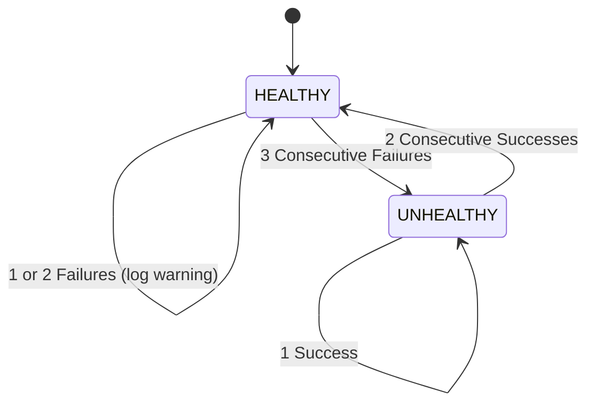

# Backend Health Checking & Resilience

PulseGate includes a proactive, background Health Checking engine that monitors the health and availability of all registered backend instances, dynamically updating the load balancing routing table.

---

## 1. Health Checker Overview

The `HealthChecker` (`src/health/healthChecker.ts`) runs as a periodic daemon inside the gateway process:
- **Polling Interval:** Every `5000ms` (`HEALTH_CHECK_INTERVAL` / `config.gateway.healthCheckInterval`).
- **Target Endpoint:** HTTP `GET http://<instance-host>:<instance-port>/health`.
- **Probe Timeout:** `3000ms` per backend probe.
- **Evaluation Criteria:** An HTTP `200 OK` response indicates health; any other status code, network error (`ECONNREFUSED`, `ETIMEDOUT`), or timeout indicates failure.

```
+--------------------------------------------------------------------------------+
|                         Health Checker Engine (5s Interval)                    |
|                                                                                |
|  Polls:                                                                        |
|  - user-service-1:4001/health  -> 200 OK  -> Streak: [Success: 1, Fail: 0]     |
|  - user-service-2:4002/health  -> 200 OK  -> Streak: [Success: 1, Fail: 0]     |
|  - user-service-3:4003/health  -> ERROR   -> Streak: [Success: 0, Fail: 1]     |
|                                                                                |
|  Updates BackendRegistry state flags                                           |
+--------------------------------------------------------------------------------+
```

---

## 2. Health State Machine & Hysteresis

To prevent **flapping** (rapid oscillation between healthy and unhealthy states caused by temporary network blips or garbage collection pauses), PulseGate uses state transition **hysteresis**:



### Transition Thresholds:
1. **Healthy $\rightarrow$ Unhealthy:** Requires **3 consecutive failures** (`failureStreak >= 3`).
2. **Unhealthy $\rightarrow$ Healthy:** Requires **2 consecutive successes** (`successStreak >= 2`).

### Why Hysteresis Matters:
- An isolated network delay or temporary CPU spike does not prematurely eject an instance from the load balancing pool.
- A recovering backend is verified stable across multiple probe cycles before receiving live client traffic.

---

## 3. Implementation Code

```typescript
// src/health/healthChecker.ts
export class HealthChecker {
  private intervalId: NodeJS.Timeout | null = null;
  private registry: BackendRegistry;
  private failureStreak: Map<string, number> = new Map();
  private successStreak: Map<string, number> = new Map();

  constructor(registry: BackendRegistry) {
    this.registry = registry;
  }

  start(): void {
    if (this.intervalId) return;
    this.intervalId = setInterval(() => {
      this.checkAll();
    }, config.gateway.healthCheckInterval);
  }

  private async checkInstance(instance: ServiceInstance): Promise<void> {
    return new Promise((resolve) => {
      const req = http.get(`http://${instance.host}:${instance.port}/health`, { timeout: 3000 }, (res) => {
        if (res.statusCode === 200) {
          this.handleSuccess(instance);
        } else {
          this.handleFailure(instance);
        }
        res.resume();
        resolve();
      });

      req.on('error', () => {
        this.handleFailure(instance);
        resolve();
      });

      req.on('timeout', () => {
        req.destroy();
        this.handleFailure(instance);
        resolve();
      });
    });
  }

  private handleSuccess(instance: ServiceInstance) {
    const streak = (this.successStreak.get(instance.id) || 0) + 1;
    this.successStreak.set(instance.id, streak);
    this.failureStreak.set(instance.id, 0);

    if (streak >= 2 && !instance.healthy) {
      logger.info(`Instance recovered: ${instance.id}`);
      this.registry.markHealthy(instance.id);
    }
  }

  private handleFailure(instance: ServiceInstance) {
    const streak = (this.failureStreak.get(instance.id) || 0) + 1;
    this.failureStreak.set(instance.id, streak);
    this.successStreak.set(instance.id, 0);

    if (streak >= 3 && instance.healthy) {
      logger.warn(`Instance unhealthy: ${instance.id}`);
      this.registry.markUnhealthy(instance.id);
    }
  }
}
```

---

## 4. Backend Registry Integration

The `BackendRegistry` (`src/registry/backendRegistry.ts`) tracks the real-time health metadata for every instance:

```typescript
export interface ServiceInstance {
  id: string;             // e.g., "user-service-2"
  service: string;        // e.g., "user-service"
  host: string;           // e.g., "user-service-2"
  port: number;           // e.g., 4002
  healthy: boolean;       // true if healthy, false if unhealthy
  lastChecked: Date;      // Timestamp of last health check probe
  failureCount: number;   // Cumulative or current failure count
  recoveryCount: number;  // Cumulative count of successful recoveries
}
```

### Traffic Isolation
When an instance is marked `healthy = false`:
- It is omitted from `backendRegistry.getHealthyInstances(service)`.
- It receives **zero incoming user requests**.
- The gateway continues polling `/health` in the background to detect when it recovers.

---

## 5. Structured Logging on State Transitions

When an instance changes state, structured log events are emitted:

### Degradation Log:
```json
{"level":"warn","message":"Instance unhealthy: user-service-2","timestamp":"2026-09-01T01:50:15.120Z"}
```

### Recovery Log:
```json
{"level":"info","message":"Instance recovered: user-service-2","timestamp":"2026-09-01T01:51:25.840Z"}
```

---

## 6. How to Demo Failure & Recovery

### Step 1: Check Current Services State
Query the admin API to verify all instances are currently healthy:

```bash
curl -s http://localhost:3000/admin/services \
  -H "Authorization: Bearer $ADMIN_TOKEN" | jq .
```

### Step 2: Stop a Backend Container
Stop `user-service-2`:

```bash
docker compose -f infra/docker/docker-compose.yml stop user-service-2
```

### Step 3: Observe Failure Detection
After ~15 seconds (3 failed probes spaced 5 seconds apart), query `/admin/services`:

```bash
curl -s http://localhost:3000/admin/services \
  -H "Authorization: Bearer $ADMIN_TOKEN" \
  | jq '.[] | select(.id == "user-service-2")'
```

**Output:**
```json
{
  "id": "user-service-2",
  "service": "user-service",
  "host": "user-service-2",
  "port": 4002,
  "healthy": false,
  "failureCount": 3,
  "recoveryCount": 0
}
```

Traffic to `/api/users` now alternates exclusively between `user-service-1` and `user-service-3`.

### Step 4: Restart the Backend Container
Restart `user-service-2`:

```bash
docker compose -f infra/docker/docker-compose.yml start user-service-2
```

### Step 5: Observe Recovery
After ~10 seconds (2 successful probes), query `/admin/services`:

```bash
curl -s http://localhost:3000/admin/services \
  -H "Authorization: Bearer $ADMIN_TOKEN" \
  | jq '.[] | select(.id == "user-service-2")'
```

**Output:**
```json
{
  "id": "user-service-2",
  "service": "user-service",
  "host": "user-service-2",
  "port": 4002,
  "healthy": true,
  "failureCount": 0,
  "recoveryCount": 1
}
```

`user-service-2` is automatically restored to the active load balancing rotation.
